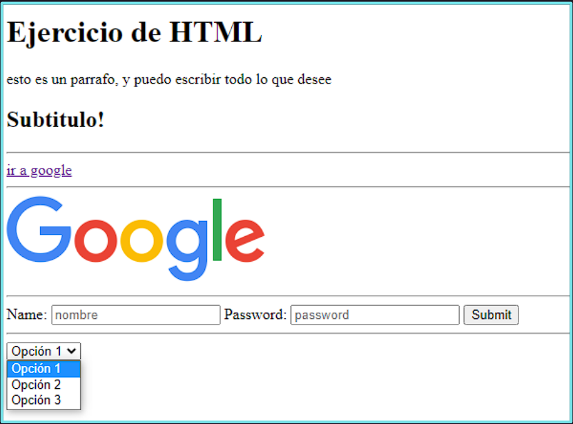

# Ejercicio 1:
Mediante el uso de HTML únicamente, replicar la siguiente página web:

# Ejercicio 2:

Realizar una hoja de vida únicamente con HTML (utilizar HTML semántico para la estructura). Deberán poner una breve descripción de ustedes, conocimientos actuales en el área IT, manejo de idiomas, educación y experiencia laboral. Además debe tener un formulario de contacto con los campos: Nombre, Asunto y Mensaje.